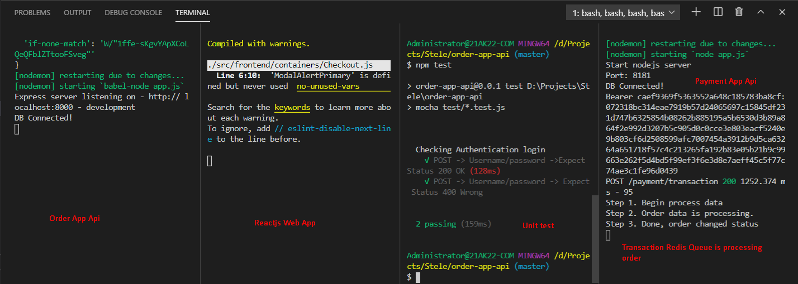

# TestAssignment

- Reactjs
- Nodejs
- NestJS FW (Pending, will be created late)
- Mongoose
- Redis

## Technical summary

Frontend

- Reactjs, redux, html, css, bootstap

Transaction

- Using Redis BeeQueue instead of Rxjs, Because i worry not enought time to complete project
- Using redis Pub/Sub for handling order to checkout to payment transaction.
- Redis lab

Backend API for Order app and Payment app

- Nodejs

NoSQL

- Mongoose stores on Mongoose lab

## User guide

Run Payment App API

- cd payment-app-api & run `npm install && pm2 start app.js`, pm2 restart this app when redis server crash automatically
- Endpoint http://localhost:8181

Run Order App Api

- cd order-app-api & run `npm install && npm start` this app uses config balelrc compile es5 & es6
- Endpoint http://localhost:8000

Run React Web App

- cd web-app & run `npm install && npm start`
- Endpoint http://localhost:3000

## Order app testing api

- cd order-app-api & run `npm test`

## Web user guide

- Please login before buy item
- Accounts are user1@test.com/123456 or user2@test.com/123456
- In order page shows order list. Each item of state `Created or Confirmed` can update to `Cancelled`
- Payment transaction will change order of state `Confirmed` to `Deliverd` state after 60 seconds. Redis Queue will do this step.

## Redis queue processes order

## Docker pending, i will make late

`Build image`
docker build -t quochungphp/order-app .

`Docker run image`
docker run -d -it  -p 80:3000/tcp --name order-app quochungphp/order-app:latest

`Docker compose start`
docker-compose -f docker-compose.yml up --build -d

`Nest CLI`
nest g service --name --no-spec
nest g controller --name --no-spec
nest g module --name --no-spec
